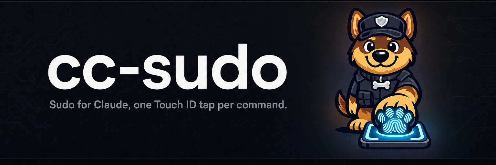

# 

**Sudo for Claude, one Touch ID tap per command.** cc-sudo puts an agent's privileged commands in front of you as native macOS Touch ID prompts — a tap runs the command, anything else cancels it.

[](https://github.com/yasyf/cc-sudo/releases)
[](https://github.com/yasyf/cc-sudo/actions/workflows/ci.yml)
[](https://github.com/yasyf/cc-sudo/blob/main/LICENSE)

## Get started

```bash
brew install --cask yasyf/tap/authkit   # the signed Touch ID / Secure Enclave helper
brew install yasyf/tap/cc-sudo
cc-sudo hello                            # smoke-test the install
sudo cc-sudo install                     # lay down the root verifier (one admin password)
```


Then hand an agent a single privileged command. The exact argv comes to the foreground in a Touch ID prompt:

```bash
cc-sudo run -- dscacheutil -flushcache
```

Driving with an agent? Paste this:

```text
Install cc-sudo (`brew install --cask yasyf/tap/authkit && brew install
yasyf/tap/cc-sudo`), run `sudo cc-sudo install` once, then run privileged
commands with `cc-sudo run -- <cmd>`. Route on the exit codes (0 approved,
103 denied, 104 unavailable, 105 verification failed, 106 version skew).
Repo: https://github.com/yasyf/cc-sudo
```

---

## Use cases

### Give an agent one privileged command, not root

An agent that needs a single `dscacheutil -flushcache` shouldn't get a standing sudo grant or a NOPASSWD rule. Instead:

```bash
cc-sudo run -- dscacheutil -flushcache
```

The exact command surfaces in a native Touch ID prompt. A tap runs it as root and hands stdout, stderr, and the exit code back to the caller; a denial returns a clean non-zero exit the agent routes around instead of stalling on a password it will never have. A root-owned verifier enforces a fresh-nonce Secure-Enclave attestation before exec, so a captured approval can't be replayed and the argv you approved is the argv that runs.

### Keep your password out of the transcript

Typing your password into an agent-driven terminal leaves it sitting in the session transcript. With cc-sudo the approval happens in a system prompt the agent never sees. Touch ID replaces the password entirely, and nothing secret enters the conversation.

### Approve from another Mac when this one is locked or headless

Over SSH, in tmux, or on a locked Mac, the prompt routes to a live peer you've enrolled with `cc-sudo trust`. You tap there; the command runs here. Routed approvals verify against the peer's enrolled key and never fall back to an unsigned verdict.

## Commands

| Command | What it does |
|---|---|
| `cc-sudo run -- <cmd>` | Run a command as root after one Touch ID tap; stdio and exit status pass through. |
| `cc-sudo install` | Lay down the root-owned verifier, sudoers rule, and enrolled Secure-Enclave key (requires sudo). |
| `cc-sudo trust <peer>` | Enroll a peer's public key for routed approvals (requires sudo). |
| `cc-sudo uninstall` | Remove the verifier, sudoers rule, and trust store (requires sudo). |
| `cc-sudo doctor [--probe-prompt]` | Check every link of the trust chain; `--probe-prompt` fires a real consent sheet. |
| `cc-sudo mcp` | Serve a `run_command` tool over MCP stdio for agent hosts. |
| `cc-sudo hello [name]` | Print a greeting — the install smoke test. |

The full flag surface lives in `cc-sudo --help`.

## How it works

`cc-sudo run` hands the argv to a root-owned verifier installed at `/Library/PrivilegedHelperTools/cc-sudo-exec`. The verifier mints a fresh nonce, requires a Secure-Enclave signature over it from the signed [authkit](https://github.com/yasyf/authkit) helper (the Touch ID tap *is* that signing operation), checks the signature against the enrolled key, pins authkit by its designated requirement, and only then execs the exact argv it hashed — no window between approval and exec. Locally the sheet renders through a `launchctl asuser` spawn; over SSH or on a locked Mac it routes to synckitd and, if needed, to a live peer.

## Development

Build with `swift build`, test with `swift test`; conventions live in [AGENTS.md](AGENTS.md).

Licensed under [PolyForm-Noncommercial-1.0.0](LICENSE).
